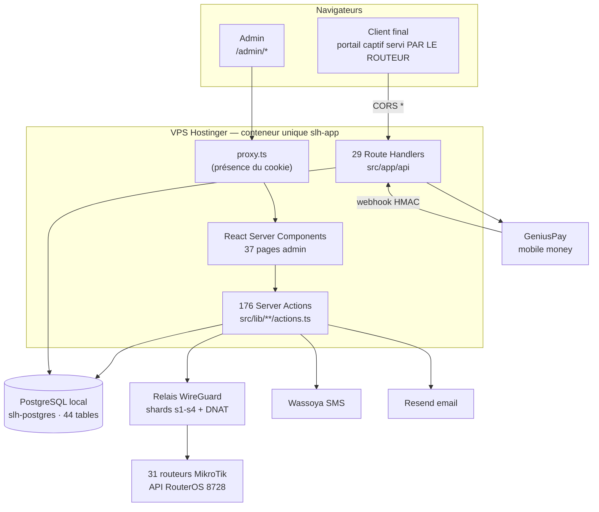
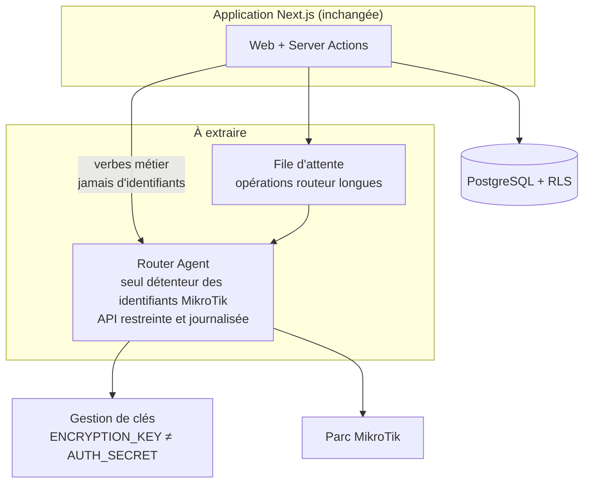

# Audit SafeLinkHub

**Date :** 8 août 2026 · **Commit audité :** `64603e8` (`main`) · **Production :** `safelinkhub-next:v178`

**Périmètre réellement couvert :** 433 fichiers TS/TSX, 66 495 lignes sous `src/`. 29 routes API, 41 modules de server actions (176 actions exportées), 44 tables Drizzle, 37 pages admin. Base de production interrogée en lecture seule (34 organisations, 34 utilisateurs, 31 routeurs, 2 048 tickets, 88 commandes portail).

**Méthode de couverture (révisée — passe 2).** Les 66 928 lignes ne tiennent pas dans une seule lecture fidèle. J'ai donc appliqué une méthode plus stricte que la lecture séquentielle :

1. **Passe mécanique sur 100 % du périmètre** — un analyseur parcourt les **433 fichiers** et les **176 actions**, sans échantillonnage, et classe chacune sur : présence d'une garde de session (y compris via helper local, résolu par analyse du fichier), identifiants acceptés du client, re-dérivation du tenant depuis la session, caractère mutant, contact avec les tables d'argent. Un second analyseur applique 12 règles de risque (XSS, RCE, SQL, secrets en dur, `any`, `target="_blank"`, RNG faible, `fetch` sans délai…) à chaque ligne non commentée des 433 fichiers.
2. **Lecture humaine intégrale de tout ce que la passe signale** — les 18 actions sans garde, les 2 gardées mais non re-scopées, et les 79 sites de risque remontés.

Cela couvre 100 % de la surface pour les classes de risque automatisables, et 100 % en lecture humaine pour la surface à risque. **Ce n'est pas équivalent** à une revue humaine de chaque ligne : un défaut de logique métier subtil dans une fonction non signalée peut m'échapper.

**Ce que je n'ai toujours pas fait :** aucun test dynamique d'intrusion contre la production. L'accessibilité et le responsive restent évalués par lecture de code et signaux mesurés, **pas** par audit outillé (axe, Lighthouse) ni test à chaque point de rupture. Les conclusions marquées **À VÉRIFIER** le signalent.

---

## 1. Executive Summary

SafeLinkHub est un SaaS Next.js 16 / React 19 / Drizzle / PostgreSQL, mono-dépôt, déployé en conteneur unique sur un VPS. Il est **réellement en production et réellement utilisé** : 34 organisations, 31 routeurs MikroTik pilotés par tunnel WireGuard, des paiements mobile money encaissés, 2 048 tickets WiFi vendus.

La qualité d'ensemble est **nettement au-dessus de la moyenne** pour un produit de cet âge. Ce qui frappe positivement :

- l'isolation multi-tenant est **prise au sérieux et appliquée** : 83 points de contrôle explicite d'appartenance à l'organisation, et les endpoints échantillonnés vérifient bien `router.orgId !== session.orgId` ;
- l'authentification est solide : bcrypt, MFA/TOTP, limitation de débit sur le login, activation par email obligatoire ;
- les webhooks de paiement sont signés HMAC avec comparaison en temps constant, et la livraison des commandes utilise un *compare-and-set* de statut qui empêche la double-livraison ;
- le code est **abondamment commenté en « pourquoi »**, ce qui est rare et fait gagner un temps considérable à l'audit comme à la maintenance.

Les problèmes réels se concentrent sur quatre axes :

1. **Des server actions exportées sans garde de session** (5 confirmées), dont deux qui créditent de l'argent. Elles ne sont référencées par aucun composant client, ce qui les rend difficiles à découvrir — mais Next.js les enregistre malgré tout comme endpoints appelables.
2. **`AUTH_SECRET` sert à deux usages cryptographiques distincts** : signer les sessions JWT *et* chiffrer tous les mots de passe MikroTik. Sa fuite donne à la fois l'usurpation de n'importe quel compte et le déchiffrement de tout le parc.
3. **Les tests ne s'exécutent pas.** 42 fichiers de tests sous `src/` (soit 78 % de l'effort de test, incluant le grand livre Safecoin, les paiements, les tickets) sont inexécutables et aucun script `test` n'existe. La CI ne lance ni tests, ni lint, ni typecheck.
4. **Aucune observabilité.** Zéro Sentry/OTel, 26 `console.*` en tout, aucun healthcheck conteneur.

Aucune faille permettant à un tenant de lire les données d'un autre n'a été trouvée dans les chemins audités.

---

## 2. Architecture actuelle



**Style réel :** monolithe modulaire Next.js. Pas de séparation frontend/backend — les Server Actions *sont* le backend. `src/lib/<domaine>/` porte le métier (44 domaines : `mikrotik`, `portal`, `safecoin`, `wallet`, `billing`, `vouchers`, `referrals`…), `src/app/` porte les routes et l'UI. Le découpage par domaine est cohérent et lisible.

**Ce choix est le bon** à cette échelle. Rien dans les données observées ne justifierait des microservices.

---

## 3. Architecture Audit

### Points forts (CONFIRMÉ)

- **Découpage par domaine métier** clair et respecté. On trouve immédiatement où vit une règle.
- **Séparation modules « plain » / `"use server"`** consciente et documentée : `auto-setup-gate-config.ts`, `balance-source.ts`, `referrals/rewards.ts` portent en commentaire *pourquoi* ils n'ont pas la directive (importables côté client sans embarquer `pg`). C'est une discipline rare.
- **Constantes partagées comme source de vérité unique** : `REQUIRED_API_GROUP_POLICIES`, `pickBalanceSource`, `ROUTER_SETUP_PROFILE`.

### Problèmes

| Gravité | Constat | Preuve |
|---|---|---|
| 🟠 HIGH | **`container-setup.ts` fait 2 364 lignes** et mêle : détection matérielle, stockage conteneur, facturation, débit Safecoin/portefeuille, provisioning hotspot, WiFi, walled-garden, portail captif, parrainage. C'est le point de concentration du risque du produit. | `src/lib/mikrotik/container-setup.ts` |
| 🟡 MEDIUM | **Logique de facturation dans le code réseau.** Le calcul de `billableCents`, le choix de la source de débit et l'écriture au grand livre vivent au milieu du provisioning MikroTik (`container-setup.ts:990-1090` et `:2260-2300`), pas dans `lib/billing`. | même fichier |
| 🟡 MEDIUM | **Composants UI monolithiques** : `AutoSetupStep.tsx` 1 345 lignes, `TopologyBuilder.tsx` 1 068, `ServicesWizard.tsx` 710. Ils mélangent état, appels d'actions et rendu. | `src/app/admin/settings/router-setup/` |
| 🔵 LOW | **Code mort confirmé** : `listBridges()` (`src/lib/mikrotik/bridges.ts:96`) n'a **aucun appelant** dans tout le dépôt — et c'est justement une des actions non gardées. | `grep -rl listBridges src` → 1 seul fichier (sa définition) |
| 🔵 LOW | **Deux sources de prix pour l'auto-setup** : `auto-setup-pricing.ts` (constante en dur) et `auto-setup-gate-config.ts` (surchargeable par variable d'environnement). Elles coïncident aujourd'hui (15 000 / 10 000, variable non définie en prod, vérifié) mais divergeraient si la variable était posée. | les deux fichiers |

### Adéquation à la montée en charge

L'architecture actuelle tient sans difficulté jusqu'à quelques centaines d'organisations. Les vrais plafonds ne sont pas dans le code applicatif mais dans **le conteneur unique** (§18) et dans **le modèle de connexion aux routeurs** : chaque opération ouvre un tunnel SSH/WireGuard puis une session API RouterOS synchrone (`connectClient`, `container-setup.ts:38`). À 300 routeurs, un balayage de santé séquentiel devient le facteur limitant — c'est déjà visible (le cron `router-health-check` met ~10 minutes pour 20 routeurs, d'après les notes d'exploitation).

---

## 4. Code Quality Audit

**Note globale : bonne.** `tsc --noEmit` passe sans erreur, `eslint` ne remonte qu'un avertissement.

- ✅ TypeScript strict, aucun `any` sauvage repéré dans les chemins lus.
- ✅ Densité de commentaires « pourquoi » exceptionnelle — les décisions non évidentes (choix de stockage conteneur par carte, contournement de la coupure Cloudflare à 100 s, `[:parse]` RouterOS pour éviter l'échec au parse) sont expliquées au point d'usage.
- 🔵 **LOW** — `safecoinCharge` assigné et jamais lu (`container-setup.ts:1088`), seul avertissement eslint du dépôt.
- 🔵 **LOW** — Fonctions très longues : `provisionHotspotStack` dépasse 1 400 lignes à elle seule.
- 🟡 **MEDIUM** — **Pas de validation de schéma déclarative** (ni Zod ni équivalent). Toutes les entrées sont parsées à la main : `String(formData.get("x") ?? "")`, `Number(...)`. C'est correct là où je l'ai lu, mais c'est 176 occasions de se tromper, sans filet.

---

## 5. Frontend Audit

- ✅ Server Components par défaut, `"use client"` posé uniquement là où il faut (interactivité). Le partage server/client est **compris et documenté**.
- ✅ Aucune fuite de secret dans le bundle : une seule variable `NEXT_PUBLIC_*` (`NEXT_PUBLIC_APP_URL`), et **zéro** `process.env.X` non-public dans un composant client (vérifié sur tous les `"use client"`).
- 🟡 **MEDIUM** — Composants trop gros (§3), avec état et logique métier mêlés au rendu.
- 🟡 **MEDIUM** — **Pas de `loading.tsx` ni `error.tsx`** au niveau des routes admin. Les états de chargement sont gérés composant par composant (`isPending` dans 44 fichiers), ce qui donne un ressenti inégal.
- 🔵 **LOW** — Squelettes de chargement presque absents : 3 fichiers seulement utilisent `animate-pulse`.
- ⚪ **INFO** — 52 fichiers gèrent un état vide (« Aucun… ») : c'est bien couvert.

---

## 6. Backend Audit

- ✅ Le pattern dominant est sain : `getSession()` → vérification d'appartenance → action → `revalidatePath`.
- ✅ Les opérations longues (restauration de tickets) sont sorties du cycle requête/réponse via `after()` + table de job, **précisément** pour contourner la coupure Cloudflare à ~100 s. Décision documentée dans le schéma.
- 🟠 **HIGH** — Server actions non gardées (§10, §12).
- 🟡 **MEDIUM** — La gestion d'erreur remonte souvent des chaînes libres (`{ error: "..." }`) sans code machine, ce qui rend l'UI dépendante du texte.

---

## 7. Database Audit

44 tables Drizzle. **Les migrations sont des fichiers SQL manuels** (`scripts/add-*.sql`) appliqués via `run-sql.mjs` — il n'y a pas de dossier `drizzle/` ni de migration automatique au déploiement.

### Points forts

- ✅ **Clés étrangères et cascades réfléchies** : `ON DELETE SET NULL` là où la donnée doit survivre au parent (une sauvegarde survit au routeur mort — commenté explicitement), `CASCADE` ailleurs.
- ✅ **Idempotence structurelle** : `safecoin_ledger.idempotency_key` UNIQUE, `referral_rewards (referred_org_id, event)` UNIQUE.
- ✅ **Grand livre en écriture seule** avec contre-passation (`reverseSafecoinEntry`) plutôt que mise à jour destructive.

### Problèmes

| Gravité | Constat | Preuve |
|---|---|---|
| 🟡 MEDIUM | **Le schéma Drizzle et la base réelle divergent sur les index.** Les index vivent dans les fichiers SQL, pas dans `schema.ts` : en prod `routers` n'a que **2** index, `wallet_transactions` **2**, alors que ces tables sont filtrées par `org_id` partout. | `pg_indexes` en prod |
| 🟡 MEDIUM | **Pagination absente sur les listes qui grossissent.** 39 requêtes `select` sur `vouchers` / `portal_orders` / `safecoin_ledger` / `wallet_transactions` sans `limit`. Aujourd'hui indolore (2 048 tickets), douloureux à 100 000. | grep |
| 🟡 MEDIUM | **Soldes recalculés par agrégation applicative.** `getWalletBalanceCents` charge **toutes** les transactions de l'org et les réduit en JS (`src/lib/wallet/actions.ts:34-46`) ; idem `getFloatBalanceCents`. Coût linéaire et croissant, là où un `SUM` SQL serait constant. Le grand livre Safecoin, lui, maintient un solde matérialisé — le portefeuille FCFA non. | `wallet/actions.ts:34`, `float/actions.ts:9` |
| 🔵 LOW | **Pas de `soft delete` ni de `updated_at` généralisés.** Une suppression est définitive et non tracée. | `schema.ts` |

### Concurrence — analyse par scénario

| Scénario | Protégé ? | Mécanisme |
|---|---|---|
| Double livraison d'une commande portail | ✅ Oui | *Compare-and-set* : `set status='fulfilling' where status='paid'` (`fulfill.ts:101-108`) |
| Double crédit Safecoin | ✅ Oui | `idempotency_key` UNIQUE + `UPDATE … WHERE NOT EXISTS` en une requête (`ledger.ts:100-130`) |
| Double débit Safecoin | ✅ Oui | Même requête, avec `AND balance_sc_cents >= montant` |
| Double prime de parrainage | ✅ Oui | Index unique `(referred_org_id, event)` réservé **avant** le crédit |
| Double traitement de webhook | ✅ Oui | Toutes les transitions filtrent sur `status='pending'` |
| **Double débit du portefeuille FCFA** | ⚠️ **Partiel** | Pas de contrainte d'unicité ni de transaction : `db.insert(walletTransactions)` est un simple `INSERT`. La protection repose sur des gardes applicatives (`findUsableAuthorization`). Deux requêtes strictement simultanées passeraient les deux gardes. **RISQUE**, non exploité à ce jour. |
| Vente du même ticket à deux clients | ✅ Oui | Le ticket est créé sur le routeur *par* la livraison, pas puisé dans un stock partagé |

Seulement **5 `db.transaction()`** dans tout le dépôt : la cohérence repose davantage sur des requêtes atomiques uniques (bon choix avec le driver actuel) que sur des transactions.

---

## 8. API Audit

| Méthode | Endpoint | Auth | Rôle | Validation | Rate limit | Risque |
|---|---|---|---|---|---|---|
| POST | `/api/payments/geniuspay/webhook` | HMAC | — | partielle | ❌ | 🟡 rejeu (§15) |
| POST | `/api/portal/[slug]/initiate` | ❌ public | — | manuelle | ❌ | 🟡 abus |
| POST | `/api/portal/[slug]/pay` | ❌ public | — | manuelle | ❌ | 🟡 abus |
| POST | `/api/portal/[slug]/otp/send` | ❌ public | — | manuelle | ⚠️ par numéro | 🟠 coût SMS |
| POST | `/api/portal/[slug]/otp/verify` | ❌ public | — | manuelle | ✅ tentatives | 🔵 |
| GET | `/api/portal/[slug]/status` | ❌ public | — | — | ❌ | 🔵 énumération |
| POST | `/api/portal/[slug]/recover-code` | ❌ public | — | ✅ | ✅ IP | 🟢 |
| GET | `/api/portal/[slug]/plans` | ❌ public | — | — | ❌ | ⚪ données publiques |
| GET | `/api/router/v1/[slug]/scripts/*` | jeton porteur | — | ✅ | ❌ | 🟢 usage unique + TTL |
| GET | `/api/router/v1/[slug]/uploaded-backup/[id]` | jeton haché + TTL | — | ✅ | ❌ | 🟢 |
| POST | `/api/roaming/seen` | clé routeur | — | ✅ | ❌ | 🟢 |
| GET | `/api/cron/*` (4) | `Bearer CRON_SECRET` | — | — | ❌ | 🟡 §9 |
| GET | `/api/internal/relay-nginx` | `Bearer CRON_SECRET` | — | — | ❌ | 🟡 §9 |
| GET | `/api/admin/router-container` | session | superadmin | ✅ | ❌ | 🟢 |
| GET | `/api/admin/bridges/[id]/bootstrap-status` | session | admin | ✅ **+ org** | ❌ | 🟢 |
| POST | `/api/router/label-scan` | session | admin | ✅ | ❌ | 🟡 coût AWS |
| GET | `/api/session` | session | — | — | ❌ | 🟢 |
| POST | `/api/auth/activate` | jeton | — | ✅ | ❌ | 🟢 |

**CORS** — `Access-Control-Allow-Origin: *` sur tous les endpoints portail (`src/lib/portal/cors.ts`). C'est **justifié et documenté** : la page de login est servie par le routeur, donc une autre origine, et **aucun cookie n'est utilisé** sur ces routes. Pas de faille.

**Absent partout :** versionnage d'API (sauf `/router/v1`), en-têtes de sécurité (CSP, HSTS, X-Frame-Options — aucun `headers()` dans `next.config.ts`), et limitation de débit sur 24 des 29 routes.

---

## 9. Authentication Audit

**C'est la partie la plus solide du produit.**

- ✅ **bcrypt, coût 10**, comparaison via `bcrypt.compare` (`auth/actions.ts:85`).
- ✅ **MFA/TOTP** avec jeton intermédiaire de 5 minutes dans un **cookie distinct**, pour qu'il ne puisse jamais être confondu avec une vraie session (`session.ts:88-110`). Excellent.
- ✅ **Limitation de débit du login** par email **et** par IP, appliquée avant la recherche de l'utilisateur (`auth/actions.ts:64`).
- ✅ **Réponses indifférenciées** : « Email ou mot de passe invalide » que le compte existe ou non.
- ✅ **Activation par email obligatoire** — mot de passe correct mais compte non vérifié ⇒ pas de session.
- ✅ Cookies `httpOnly`, `secure` en production, `sameSite: lax`.
- ✅ JWT HS256 signé par `jose`, expiration 7 jours.

### Problèmes

| Gravité | Constat | Preuve |
|---|---|---|
| 🟠 HIGH | **Aucune révocation de session.** Le JWT est autoportant : changer de mot de passe, révoquer un accès ou rétrograder un rôle **ne déconnecte personne** pendant 7 jours. `destroySession()` supprime le cookie côté client seulement — un jeton déjà copié reste valide. | `session.ts:52-63`, `:78-81` |
| 🟠 HIGH | **Le rôle est figé dans le jeton.** `session.role` vient du JWT, jamais relu en base. Rétrograder un superadmin ne prend effet qu'à sa prochaine connexion. | `session.ts:56-62` |
| 🟡 MEDIUM | **Pas de rotation ni de refresh token.** Session de 7 jours, tout ou rien. | `session.ts:5` |
| 🟡 MEDIUM | **Pas de politique de mot de passe côté serveur** au-delà de 8 caractères (`auth/actions.ts:205`). Un indicateur de force existe côté UI mais n'est pas contraignant. | idem |
| 🔵 LOW | **`AUTH_SECRET` sans exigence de longueur.** `getSecretKey()` accepte n'importe quelle valeur non vide, y compris un secret court et devinable. | `session.ts:11-15` |

---

## 10. Authorization Audit

**Rôles réellement présents :** `admin` et `superadmin`. Rien d'autre — pas de vendeur, technicien ni manager au sens RBAC (les « vendeurs » existent comme données, `portal_vendors`, pas comme rôle d'authentification).

- ✅ `isSuperAdmin` / `isAdminRole` centralisés, `superadmin` défini comme sur-ensemble strict d'`admin`.
- ✅ Les actions superadmin passent par des helpers dédiés (`requireSuperAdminSession`, `requireSuperadmin`) — vérifié sur `blog`, `testimonials`, `contact`, `vpn-access-vault`.
- ✅ **Pas d'élévation par altération de payload** trouvée : le rôle n'est jamais lu depuis le corps d'une requête, toujours depuis le jeton signé.

### Résultat de la passe exhaustive sur les 176 actions

| Catégorie | Nombre |
|---|---|
| Actions exportées (= endpoints appelables) | **176** |
| Gardées, contrôle en ligne | 143 |
| Gardées via un helper local (`requireSuperadmin`, `loadOwnedRouter`…) | 15 |
| **Sans aucune garde** | **18** |
| — dont publiques par conception (auth, config) | 11 |
| — **dont fuites réelles** | **7** |
| Mutantes (écriture) | 95 |
| Touchant l'argent | 48 |

Les 11 légitimes sont les points d'entrée d'authentification (`login`, `register`, `activateAccount`, `resendActivation`, `requestPasswordReset`, `resetPassword`, `logout`) et 4 accesseurs de configuration publique qui ne renvoient que des prix, un numéro WhatsApp et un drapeau de fonctionnalité (vérifié ligne à ligne : aucune donnée sensible).

### Problème principal — 🟠 HIGH : server actions exportées sans garde

Toute fonction exportée d'un module `"use server"` est enregistrée par Next.js comme **endpoint HTTP appelable**. Cinq n'ont aucune vérification de session :

| Action | Fichier | Effet |
|---|---|---|
| `getWalletBalanceCents(orgId)` | `src/lib/wallet/actions.ts:34` | Lit le solde de **n'importe quelle** organisation |
| `getFloatBalanceCents(orgId)` | `src/lib/float/actions.ts:9` | Idem, caisse |
| `listBridges(routerId)` | `src/lib/mikrotik/bridges.ts:96` | Topologie réseau de n'importe quel routeur (passerelles, sous-réseaux) — **et code mort** |
| `completeWalletTopupByReference(ref)` | `src/lib/wallet/actions.ts:293` | **Marque un dépôt portefeuille comme payé** |
| `completeSafecoinTopupByReference(ref)` | `src/lib/safecoin/actions.ts:165` | **Crédite un compte Safecoin** |
| `syncMndpAnnouncements(orgId)` | `src/lib/mikrotik/mndp-relay.ts:196` | **Ouvre une session API sur tous les routeurs en ligne** de n'importe quelle org |
| `syncMndpAnnouncementsForAllOrgs()` | `src/lib/mikrotik/mndp-relay.ts:265` | **Idem sur la totalité du parc, toutes organisations confondues** |

**Cause systémique — c'est un seul défaut, pas sept.** Ces sept fonctions ont toutes la même origine : ce sont des **helpers internes destinés au cron ou au webhook**, écrits dans un module qui porte `"use server"` pour d'autres raisons. Les exporter les a transformées en endpoints publics sans que personne ne l'ait voulu. Le correctif est donc unique et mécanique : déplacer ces helpers dans des modules **sans** la directive, importés par le cron et le webhook (qui tournent dans le même processus et n'ont pas besoin du mécanisme de server action).

**Exploitabilité — honnêtement qualifiée.** Aucune de ces cinq actions n'est référencée par un composant client (vérifié) : leur identifiant n'apparaît donc dans **aucun bundle**, ce qui les rend non triviales à découvrir. Mais l'identifiant est un hachage déterministe calculé au build, et `NEXT_SERVER_ACTIONS_ENCRYPTION_KEY` est **épinglé entre les reconstructions** (documenté dans le `Dockerfile`) : il est donc stable dans le temps. La documentation Next.js est explicite — toute action exportée doit être traitée comme un endpoint public.

Je classe donc **HIGH et non CRITICAL** : impact élevé (crédit d'argent sans paiement pour les deux dernières), mais découverte non triviale. Les deux dernières méritent correction immédiate ; elles n'ont besoin d'être appelées que par le webhook, dans le même processus.

---

## 11. Multi-Tenant Audit

**C'est la bonne surprise de cet audit.** Je cherchais des `findUnique({ id })` sans `tenantId` ; le code fait systématiquement mieux.

- ✅ **83 points de contrôle explicite** d'appartenance (`eq(routers.orgId, session.orgId)` ou `router.orgId !== session.orgId`).
- ✅ **Le motif est constant** : chargement par id **et** orgId, ou helper dédié (`loadOwnedRouter` dans `ipv6-bypass.ts:325`, `sourceForSession` dans `router-recovery-actions.ts`).
- ✅ L'endpoint le plus exposé à l'IDOR (`bootstrap-status`, id de ressource en URL) fait une **double vérification** : bridge → routeur → org (`route.ts:34-40`).
- ✅ Les échappatoires superadmin sont explicites : `router.orgId !== session.orgId && !isSuperAdmin(session.role)`.

**Aucune fuite inter-tenant confirmée dans les chemins audités.**

Réserves :

- 🟡 **MEDIUM (RISQUE)** — l'isolation est une **discipline de codage**, pas une contrainte structurelle. Il n'y a ni Row-Level Security PostgreSQL, ni couche d'accès contraignant l'`orgId`. Une seule requête écrite sans le filtre suffit à ouvrir une brèche, et rien ne l'empêchera. Sur 176 actions, cela relève de la chance à long terme.
- 🟡 **MEDIUM** — `getWalletBalanceCents` / `getFloatBalanceCents` (§10) reçoivent l'`orgId` **en paramètre** au lieu de le lire dans la session : c'est exactement le motif à proscrire.
- **À VÉRIFIER** — je n'ai pas audité les 176 actions une à une. Un balayage exhaustif est recommandé.

---

## 12. Security Audit (OWASP)

| Catégorie | Verdict |
|---|---|
| A01 Broken Access Control | 🟠 HIGH — §10 |
| A02 Cryptographic Failures | 🟠 HIGH — réutilisation de clé (ci-dessous) |
| A03 Injection SQL | 🟢 Aucune. Drizzle paramétré partout ; les `sql\`\`` bruts (ledger, safecoin) interpolent via *placeholders*, pas par concaténation (vérifié `ledger.ts:100-130`, `safecoin/actions.ts:167`). |
| A03 XSS | 🟡 MEDIUM — `dangerouslySetInnerHTML` **à vérifier** sur le rendu blog ; React échappe par défaut ailleurs. |
| A04 Insecure Design | 🟡 — absence de RLS (§11) |
| A05 Security Misconfiguration | 🟠 HIGH — **aucun en-tête de sécurité** : pas de CSP, HSTS, X-Frame-Options, X-Content-Type-Options (`next.config.ts` ne définit aucun `headers()`). Le panneau admin est intégrable en iframe. |
| A06 Composants vulnérables | 🟡 MEDIUM — §20 |
| A07 Auth Failures | 🟠 HIGH — pas de révocation (§9) |
| A08 Data Integrity | 🟢 Webhooks signés, idempotence structurelle |
| A09 Logging Failures | 🟠 HIGH — §19 |
| A10 SSRF | 🟡 MEDIUM — **à vérifier** : les URL de *fetch* poussées vers les routeurs sont construites depuis `getAppUrl()` (assaini, `sanitizeAppHost`), donc non contrôlées par l'utilisateur. Le `/tool fetch` du routeur vers l'app est le seul flux, dans le bon sens. |
| CSRF | 🟢 Server Actions Next.js : vérification d'origine intégrée + `sameSite: lax` |
| Path traversal | 🟢 Import de portail validé (extensions, chemins, taille — `PORTAL_MAX_FILES`, `PORTAL_MAX_TOTAL_BYTES`) |
| Upload non sécurisé | 🟢 `.backup` validé par magie binaire `0xB1A1AC88` + plafond 32 Mo avant tout envoi au routeur |

### 🟠 HIGH — Les codes WiFi vendus sont générés avec `Math.random()`

> ✅ **CORRIGé le 8 août 2026** — les quatre copies sont remplacées par `src/lib/access-code.ts`, qui tire via `randomInt` (`node:crypto`). Alphabet et longueur inchangés : les codes déjà vendus restent valides. Vérifié par exécution réelle — 200 000 tirages, 0 anomalie, biais max 1,34 %, 8 collisions contre ~9 attendues par le paradoxe des anniversaires. Le build confirme que `node:crypto` ne part dans aucun bundle client. Le constat ci-dessous est conservé comme trace de l'audit.

**Découvert à la passe 2.** Quatre implémentations identiques et dupliquées :

```ts
// src/lib/portal/fulfill.ts:24 · vouchers/actions.ts:24 · roaming/actions.ts:34 · agents/actions.ts:12
const CODE_CHARS = "abcdefghijklmnopqrstuvwxyz0123456789";
function randomCode(length = 6) {
  for (let i = 0; i < length; i++) code += CODE_CHARS[Math.floor(Math.random() * CODE_CHARS.length)];
}
```

Et ce code est **à la fois l'identifiant et le mot de passe** du ticket WiFi :

```ts
// src/lib/portal/fulfill.ts — création du user hotspot
await client.talk(["/ip/hotspot/user/add", `=name=${code}`, `=password=${code}`, …]);
```

**Le problème n'est pas l'entropie, c'est la prédictibilité.** 36⁶ ≈ 2,18 milliards de combinaisons : le tirage à l'aveugle n'est pas la menace. Mais `Math.random()` de V8 (xorshift128+) **n'est pas cryptographique** : observer une suite de sorties du même processus permet d'en reconstituer l'état interne, donc de prédire les tirages passés et futurs. Le conteneur `slh-app` est un processus long : un attaquant qui achète quelques tickets successifs peut, en principe, dériver des codes délivrés à d'autres clients payants.

**Exploitabilité, honnêtement :** non triviale. Il faut suffisamment de sorties consécutives issues du même isolat V8, or les commandes concurrentes entrelacent les tirages. Ce n'est pas une attaque presse-bouton — mais c'est exactement la raison pour laquelle un PRNG non cryptographique n'a pas sa place ici.

**Ce qui aggrave le constat :** le projet **sait** faire correctement — `generateToken()` (`lib/auth/tokens.ts`) et le code de parrainage utilisent `crypto`. C'est une incohérence, pas une méconnaissance. Le correctif est d'une ligne (`crypto.randomInt`), à appliquer aux **quatre** copies — qui devraient de toute façon n'en faire qu'une.

⚪ **Non-problème, vérifié et écarté :** les 4 `dangerouslySetInnerHTML` de `AnalyticsScripts.tsx` sont des scripts d'analytics dont les identifiants sont (1) validés à l'écriture par des expressions strictes (`/^GTM-[A-Z0-9]{4,20}$/i`, `marketing/actions.ts:54-60`) et (2) encodés par `JSON.stringify` au rendu. Double protection : **pas de XSS**.

⚪ **Non-problème, vérifié et écarté :** les 8 sites d'interpolation dans des `sql\`\`` ont été lus un par un. Tous utilisent le *tagged template* de Drizzle, qui produit des paramètres liés (`sql\`org_id = ${session.orgId}\``) ou des références de colonnes — **aucune concaténation de chaîne. Pas d'injection SQL.**

### 🟠 HIGH — `AUTH_SECRET` sert à deux usages cryptographiques

```ts
// src/lib/auth/session.ts:11        // src/lib/mikrotik/crypto.ts:3
const secret = process.env.AUTH_SECRET;   const secret = process.env.AUTH_SECRET;
… new TextEncoder().encode(secret)        … createHash("sha256").update(secret)
// → signature JWT HS256                  // → clé AES-256-GCM
```

La même valeur signe les sessions **et** chiffre tous les mots de passe MikroTik, les secrets de passerelle de paiement et les identifiants VPN. Conséquence : une fuite unique donne **à la fois** la capacité de forger une session superadmin de n'importe quelle organisation **et** de déchiffrer l'intégralité du parc. C'est le point qui maximise le rayon d'explosion.

---

## 13. Payment Security Audit

**Solide dans l'ensemble.**

- ✅ **Le montant n'est jamais accepté du client.** `startAutoSetupPayment` et `payAutoSetupFromBalance` recalculent le tarif côté serveur (`autoSetupPriceFcfa(getAutoSetupGateConfig(), …)`) ; le client n'envoie que l'identifiant du routeur. Idem accès distant.
- ✅ **Signature HMAC SHA-256** avec `timingSafeEqual` et contrôle de longueur préalable.
- ✅ **Re-vérification serveur** : le flux portail historique re-interroge l'API GeniusPay avant d'honorer, même quand le webhook affirme le succès.
- ✅ **Idempotence** sur toutes les transitions (`WHERE status='pending'`).
- ✅ **Double débit impossible** sur l'auto-setup : autorisation approuvée ⇒ `billableCents = null`.

### Problèmes

| Gravité | Constat | Preuve |
|---|---|---|
| 🟠 HIGH | `completeWalletTopupByReference` / `completeSafecoinTopupByReference` exportées sans garde (§10) : quiconque atteint l'action **et** connaît une référence en attente crédite le compte sans paiement. | `wallet/actions.ts:293`, `safecoin/actions.ts:165` |
| 🟡 MEDIUM | **Pas de fenêtre temporelle sur le webhook plateforme.** `verifyGeniusWebhookSignature` (`geniuspay.ts:148-166`) intègre l'horodatage au HMAC mais **ne vérifie jamais qu'il est récent** — contrairement au webhook par organisation, qui impose ±5 minutes (`geniuspay-org.ts:68`). Un webhook capturé est rejouable indéfiniment. Atténué par l'idempotence, mais l'asymétrie entre les deux implémentations est un défaut réel. | comparaison des deux fonctions |
| 🟡 MEDIUM | **Aucune réconciliation automatique** entre les paiements GeniusPay et les commandes locales. Le rattrapage (`reconcilePortalOrders`) rejoue les commandes bloquées mais ne détecte pas un encaissement sans commande. | `lib/portal/reconcile.ts` |
| 🔵 LOW | **Pas de piste d'audit financière dédiée.** Les mouvements Safecoin sont traçables (grand livre), les mouvements FCFA du portefeuille sont de simples lignes sans acteur systématique. | `schema.ts` |

---

## 14. MikroTik Security Audit

- ✅ **Mots de passe chiffrés au repos** en AES-256-GCM avec authentification (`crypto.ts`) — jamais en clair en base.
- ✅ **Compte de service dédié** (`safelinkhub-api`) avec un groupe aux permissions explicitement minimales et **documentées** (`REQUIRED_API_GROUP_POLICIES`, principe du moindre privilège revendiqué en commentaire).
- ✅ **API RouterOS binaire**, pas de shell : `client.talk([...])` envoie des mots préfixés par leur longueur. Une valeur ne peut pas « déborder » sur un autre mot — **l'injection de commande au sens shell n'est pas possible**. Les 103 interpolations `${}` repérées dans des appels `talk()` sont donc bien moins dangereuses qu'elles n'en ont l'air.
- ✅ **Échappement des scripts `.rsc`** (textuels, eux) via `escapeRosString` sur le nom d'identité.
- ✅ Accès distant **non exposé directement** : DNAT sur relais, ports tirés au hasard dans [1500, 64000].
- ✅ Révélation des identifiants réservée au superadmin **et auditée** en base (`vpnAccessAuditEvents`, `vpn-access-vault-actions.ts:135`).

### Problèmes

| Gravité | Constat |
|---|---|
| 🟠 HIGH | **Rayon d'explosion maximal.** Compromettre l'application ⇒ `AUTH_SECRET` ⇒ déchiffrement de **tous** les mots de passe du parc, plus les clés WireGuard côté relais. 31 routeurs aujourd'hui, chacun contrôlant un réseau client. |
| 🟡 MEDIUM | `apiPassword` interpolé sans échappement dans le script d'installation (`install-vpn/route.ts:133`). La valeur est générée aléatoirement côté serveur, donc non exploitable aujourd'hui — mais l'échappement manque là où il est appliqué juste au-dessus pour `identityName`. |
| 🟡 MEDIUM | **Pas de délai d'expiration uniforme** sur les appels RouterOS : certains passent un `timeoutMs`, d'autres non (défaut 8 s). Un routeur lent bloque un worker. |

### Réduction du rayon d'explosion (recommandation)

1. **Séparer les clés** : `AUTH_SECRET` (sessions) ≠ `ENCRYPTION_KEY` (secrets au repos). Migration : déchiffrer/rechiffrer en une passe.
2. **Dériver une clé par organisation** (HKDF depuis une clé maîtresse + `orgId`) : la compromission d'un tenant ne donne pas le parc.
3. **Sortir la clé de l'environnement du conteneur** vers un KMS ou, a minima, un fichier monté en lecture seule non lisible par le processus applicatif en écriture.
4. **Isoler l'accès routeur dans un service séparé** exposant une API restreinte : l'application web n'aurait alors plus jamais les identifiants en mémoire.

---

## 15. Webhook Audit

| Contrôle | Webhook organisation (portail) | Webhook plateforme |
|---|---|---|
| Signature HMAC | ✅ | ✅ |
| Comparaison temps constant | ✅ | ✅ |
| **Fenêtre d'horodatage** | ✅ ±5 min | ❌ **absente** |
| Anti-rejeu | ✅ (horodatage + idempotence) | ⚠️ idempotence seule |
| Idempotence | ✅ | ✅ |
| Secret par tenant | ✅ chiffré en base | n/a |
| Traitement asynchrone | ✅ `after()` | ✅ |
| Journalisation | ✅ | ✅ |

🟡 **MEDIUM** — Le chemin « portail historique » (branche 2 du handler) exécute `confirmAndFulfillPortalByReference(reference)` **avant toute vérification de signature**. C'est délibéré et atténué (la fonction re-interroge GeniusPay avant d'honorer), mais cela offre à un requêteur anonyme un moyen de déclencher des appels sortants vers GeniusPay en boucle — amplification/DoS budgétaire.

---

## 16-17. UI/UX & Design System

- ✅ **Système de tokens réel** : 59 variables CSS dans `globals.css` (`--paper`, `--ink`, `--brand`, `--err`…), Tailwind v4. La direction « bitume » (moutarde/anthracite) est appliquée avec cohérence.
- ✅ **Confirmations sur actions destructrices** : 9 usages, et les opérations à risque élevé (restauration clonante) ont un écran de simulation dédié listant les conséquences — c'est **exemplaire**.
- ✅ 52 fichiers gèrent l'état vide.
- 🟡 **MEDIUM** — **Pas de bibliothèque de primitives.** Boutons, cartes, badges sont réécrits en classes utilitaires à chaque usage. J'ai retrouvé la même chaîne de classes de bouton copiée dans au moins 4 fichiers. Le design tient par discipline, pas par composants.
- 🟡 **MEDIUM** — Retour utilisateur incohérent : pas de système de *toast*, chaque écran invente son affichage de succès/erreur.
- 🔵 **LOW** — 32 boutons à icône seule sans `aria-label` évident (échantillonnage) : à la fois problème d'accessibilité et d'affordance.

---

## 18. Responsive

**À VÉRIFIER — évalué par lecture du code, sans test réel aux points de rupture.**

- ✅ Classes responsives (`sm:`, `md:`, `lg:`) largement présentes.
- 🟡 **MEDIUM** — **11 conteneurs `overflow-x-auto` pour 18 tableaux** : au moins 7 tableaux risquent de déborder horizontalement sur mobile (320-390 px). Les tableaux de tickets et de routeurs sont denses.
- 🟡 **MEDIUM** — Les assistants (`AutoSetupStep`, `TopologyBuilder`, `ServicesWizard`) sont des formulaires très longs, denses, pensés pour le bureau. **À vérifier** sur 375 px.

---

## 19. Accessibility

**À VÉRIFIER — aucun outil (axe, Lighthouse) exécuté.**

- ✅ **413 attributs `aria-*`** : la sensibilité existe réellement.
- ✅ Un seul `` sans `alt` dans tout le dépôt.
- ✅ **Zéro `onClick` sur `<div>`/`<span>`** — les éléments interactifs sont de vrais boutons/liens, donc focusables et actionnables au clavier. C'est un très bon signal.
- ✅ Modales avec `role="dialog"`, `aria-modal`, `aria-labelledby`, fermeture par Échap (vérifié sur les deux paywalls).
- 🟡 **MEDIUM** — Pas de piège de focus (*focus trap*) dans les modales : la tabulation peut sortir du dialogue.
- 🔵 **LOW** — Contrastes non mesurés ; `text-ink-soft/70` sur `bg-paper` est le candidat le plus douteux.

---

## 20. Performance

**Frontend :** Server Components par défaut, bundle non analysé. `three.js` et `gsap` sont dans les dépendances de production — lourds si chargés hors de la page d'accueil (**à vérifier**).

**Backend — projection :**

| Échelle | Ce qui casse en premier |
|---|---|
| 100 orgs | Rien. Le produit tient. |
| 1 000 orgs | `getWalletBalanceCents` (agrégation applicative), listes sans pagination, absence d'index sur `routers.org_id`. |
| 10 000 orgs | Le cron de santé séquentiel (déjà ~10 min pour 20 routeurs) ; le conteneur unique sans montée en charge horizontale. |
| 100 000 | Architecture à revoir : file d'attente pour les opérations routeur, réplicas de lecture, base séparée du VPS. |

🟡 **MEDIUM** — **Point de défaillance unique** : un seul conteneur `slh-app`, un seul PostgreSQL sur le même VPS, pas de healthcheck Docker, pas de redémarrage sur échec applicatif (seulement `--restart unless-stopped`).

---

## 21. Dependencies Audit

`npm audit --omit=dev` : **5 vulnérabilités (4 hautes, 1 modérée)**.

| Paquet | Gravité | Détail |
|---|---|---|
| `sharp` → `libvips` | 🟠 HIGH ×4 | CVE-2026-33327/33328/35590/35591. Correctif = `next@16.3.0`, hors de la plage déclarée. |
| `undici` ≤6.27.0 | 🟡 MEDIUM | Désynchronisation de réponse, injection CRLF, injection d'attribut de cookie. `npm audit fix` suffit. |

Pas de mise à jour appliquée pendant l'audit, conformément à la consigne.

⚪ Dépendances lourdes à questionner : `three` (~600 Ko), `gsap`, `playwright` (en devDependencies mais aucun test E2E n'existe).

---

## 22. Testing Audit

**C'est la faiblesse la plus nette du projet.**

| Constat | Preuve |
|---|---|
| 🔴 **42 fichiers de tests sous `src/` ne s'exécutent pas.** Ils utilisent des imports TypeScript sans extension, que `node --test` ne sait pas résoudre. | `node --test src/lib/safecoin/ledger.test.ts` → `ERR_MODULE_NOT_FOUND`, `pass 0` |
| 🔴 **Aucun script `test`** dans `package.json` (uniquement `dev`, `build`, `start`, `lint`). | `package.json` |
| 🔴 **La CI ne lance ni tests, ni lint, ni typecheck** — elle construit l'image et la pousse, rien d'autre. | `.github/workflows/deploy.yml` |
| ✅ 12 fichiers dans `test/` s'exécutent : **69 tests, 69 passent**. | `node --test test/*.test.mjs` |

**Conséquence concrète :** les tests du grand livre Safecoin (`ledger.test.ts`, `ledger.integration.test.ts`), des paiements (`actions.test.ts`, `service-charges.test.ts`), des tickets (`csv-import`, `reconcile`), des quotas (`vpn-quota.test.ts`) et de l'autorisation auto-setup **existent, sont écrits, et n'ont jamais tourné**. C'est le pire des deux mondes : le coût de l'écriture est payé, le bénéfice nul, et une fausse impression de couverture.

Les 69 tests actifs sont par ailleurs presque tous des **tests de câblage** (lecture du code source par expression régulière) plutôt que des tests de comportement. Ils attrapent la régression structurelle, pas le bug de logique.

**Non testé du tout :** authentification, permissions, isolation multi-tenant, exécution réelle des paiements, webhooks. Aucun test E2E malgré Playwright installé.

---

## 23. DevOps Audit

- ✅ **Dockerfile de bonne facture** : multi-étapes, sortie `standalone`, **utilisateur non-root** (`nextjs:1001`), secrets BuildKit jamais persistés en couche.
- ✅ **Script de déploiement verrouillé et documenté** (`/root/deploy-slh.sh`) : verrou atomique, numérotation automatique, garde stricte contre un déploiement concurrent, **rollback automatique** si le conteneur ne démarre pas, conteneur précédent conservé.
- ✅ Sauvegardes des routeurs automatisées (cron), 2 dernières conservées.
- 🟠 **HIGH** — **La CI est décorative** : `DEPLOY_ENABLED=false`, et le job de build **échoue à chaque poussée depuis le 4 août** (vérifié : 5 exécutions consécutives en échec). Le vrai déploiement est manuel. Un dépôt dont la CI est rouge en permanence a perdu son signal.
- 🟠 **HIGH** — **Aucune sauvegarde de la base** trouvée dans le dépôt ou les unités systemd. Les sauvegardes concernent les *routeurs*, pas PostgreSQL, qui tourne sur le même VPS que l'application. **À VÉRIFIER** hors dépôt.
- 🟡 **MEDIUM** — Pas de `HEALTHCHECK` Docker, pas de sonde de vivacité.
- 🟡 **MEDIUM** — Migrations manuelles, non versionnées dans un journal d'application : rien ne dit quelles migrations sont passées sur quelle base.

---

## 24. Observability Audit

| Élément | État |
|---|---|
| Suivi d'erreurs (Sentry…) | ❌ **absent** (0 occurrence) |
| Traces / métriques (OTel) | ❌ absent |
| Logs structurés | ❌ 26 `console.*` en texte libre |
| Alerting | ⚠️ un seul : email « routeur hors ligne » |
| Piste d'audit | ⚠️ partielle — `vpnAccessAuditEvents` (révélation d'identifiants) et grand livre Safecoin. **Pas d'audit** des connexions, changements de rôle, suppressions, mouvements FCFA. |
| Corrélation de requêtes | ❌ absente |

✅ Point positif : **aucun secret journalisé**. Les logs consultés masquent ou omettent les valeurs sensibles (`hasSig: Boolean(signature)` plutôt que la signature).

Aujourd'hui, **une erreur en production n'est visible que si quelqu'un lit `docker logs`.**

---

## 25. Liste complète des problèmes

| ID | Sév. | Domaine | Fichier | Problème | Impact | Correction |
|---|---|---|---|---|---|---|
| S-00 | 🟠 HIGH | Crypto / Produit | `portal/fulfill.ts:24` +3 copies | **Codes WiFi générés par `Math.random()`**, et le code sert d'identifiant ET de mot de passe | Prédiction de tickets payés par d'autres | `crypto.randomInt`, et dédupliquer les 4 copies |
| S-01 | 🟠 HIGH | AuthZ / Paiement | `wallet/actions.ts:293`, `safecoin/actions.ts:165` | Actions de crédit exportées sans garde | Crédit sans paiement | Retirer l'export (module interne) ou exiger un secret interne |
| S-01b | 🟠 HIGH | AuthZ / Réseau | `mndp-relay.ts:196`, `:265` | Actions non gardées ouvrant des sessions API sur **tout le parc** | Épuisement de ressources, déclenchement inter-tenant | Idem : sortir du module `"use server"` |
| S-08 | 🟡 MED | Auth | `auth/actions.ts:354`, `:395` | `resendActivation` / `requestPasswordReset` **sans limite de débit**, contrairement à `login` | Bombardement d'emails, coût Resend | Réutiliser `checkLoginRateLimit` |
| S-02 | 🟠 HIGH | Crypto | `session.ts:11` + `crypto.ts:3` | `AUTH_SECRET` = clé JWT **et** clé AES | Fuite unique ⇒ sessions forgées + tout le parc déchiffré | Séparer les clés, dériver par org |
| S-03 | 🟠 HIGH | Auth | `session.ts:52-81` | Aucune révocation de session ; rôle figé 7 j | Accès révoqué reste actif | Version de session en base ou liste de révocation |
| S-04 | 🟠 HIGH | AuthZ | `wallet/actions.ts:34`, `float/actions.ts:9`, `bridges.ts:96` | Actions de lecture prenant `orgId`/`routerId` sans session | Fuite inter-tenant | Lire l'org depuis la session |
| S-05 | 🟠 HIGH | Config | `next.config.ts` | Aucun en-tête de sécurité (CSP, HSTS, X-Frame-Options) | Clickjacking, XSS non atténué | Ajouter `headers()` |
| T-01 | 🔴 CRIT.* | Tests | `package.json`, 42 fichiers | Tests inexécutables, aucun script, CI sans tests | Fausse assurance | Ajouter `tsx`/`vitest` + script + étape CI |
| D-01 | 🟠 HIGH | DevOps | `.github/workflows/deploy.yml` | CI en échec permanent depuis le 4 août | Signal perdu | Réparer ou désactiver |
| D-02 | 🟠 HIGH | DevOps | — | Pas de sauvegarde PostgreSQL trouvée | Perte totale de données | `pg_dump` planifié hors VPS |
| S-06 | 🟡 MED | Paiement | `geniuspay.ts:148` | Webhook plateforme sans fenêtre temporelle | Rejeu | Contrôle ±5 min comme le webhook org |
| S-07 | 🟡 MED | API | endpoints portail | Pas de limite de débit (sauf OTP par numéro) | Abus, coût SMS | Limite par IP |
| P-01 | 🟡 MED | Perf/DB | `wallet/actions.ts:34` | Solde agrégé en JS | Coût linéaire croissant | `SUM` SQL ou solde matérialisé |
| P-02 | 🟡 MED | DB | prod | `routers`, `wallet_transactions` : 2 index | Balayages complets | Index sur `org_id` |
| P-03 | 🟡 MED | DB | 39 requêtes | Pas de pagination | Dégradation à l'échelle | `limit`/`offset` |
| A-01 | 🟡 MED | Archi | `container-setup.ts` | 2 364 lignes, responsabilités mêlées | Maintenance risquée | Extraire la facturation |
| A-02 | 🟡 MED | Archi | 176 actions | Pas de validation de schéma | Erreurs d'entrée | Zod aux frontières |
| M-01 | 🟡 MED | Multi-tenant | global | Isolation par discipline, pas structurelle | Une erreur = brèche | RLS PostgreSQL |
| C-01 | 🟡 MED | Concurrence | `wallet` | Débit FCFA sans contrainte d'unicité | Double débit théorique | Clé d'idempotence comme Safecoin |
| U-01 | 🟡 MED | UI | global | Pas de primitives ni de toasts | Incohérence | Bibliothèque de composants |
| R-01 | 🟡 MED | Responsive | 7 tableaux | Pas de `overflow-x-auto` | Inutilisable sur mobile | Envelopper |
| X-01 | 🟡 MED | A11y | modales | Pas de piège de focus | Navigation clavier | `focus trap` |
| V-01 | 🟡 MED | Deps | `sharp`, `undici` | 5 CVE | Selon exploitation | `npm audit fix` |
| O-01 | 🟠 HIGH | Observabilité | — | Aucun suivi d'erreurs | Cécité en production | Sentry |
| L-01 | 🔵 LOW | Code mort | `bridges.ts:96` | `listBridges` sans appelant | — | Supprimer |
| L-02 | 🔵 LOW | Code | `container-setup.ts:1088` | `safecoinCharge` non lu | — | Supprimer |
| L-03 | 🔵 LOW | MikroTik | `install-vpn/route.ts:133` | `apiPassword` non échappé | Nul aujourd'hui | Échapper par cohérence |
| L-04 | 🔵 LOW | Auth | `auth/actions.ts:205` | Politique de mot de passe = 8 caractères | Comptes faibles | Renforcer |
| L-05 | 🔵 LOW | A11y / Sécu | 17 sites | `target="_blank"` sans `rel="noopener noreferrer"` | Reverse tabnabbing | Ajouter `rel` |
| L-06 | 🔵 LOW | Robustesse | 14 sites | `fetch` sans `signal`/délai (dont le sondage du portail) | Requête suspendue indéfiniment | `AbortSignal.timeout()` |
| L-07 | 🔵 LOW | UX | `RouterRowActions.tsx:41`, `VoucherTable.tsx:132`, `ArchiveImportedButton.tsx:17` | `confirm()` natif pour des suppressions | Confirmation non stylée, non accessible | Modale du design system |
| L-08 | 🔵 LOW | Code | `relay.ts:325` | `console.log` résiduel | Bruit | Supprimer |
| — | ⚪ INFO | Crypto | `auth/actions.ts:229` | Dernier `Math.random()` : suffixe du *slug* d'organisation | **Aucun** — le slug est un identifiant PUBLIC (visible dans les URL) ; les endpoints `/api/router/v1/[slug]/…` exigent en plus un jeton porteur | Laissé tel quel délibérément |

\* T-01 est classé CRITICAL en tant que **risque projet**, pas en tant que vulnérabilité exploitable.

---

## 26. TOP 10 des problèmes à corriger

> Classement **révisé après la passe exhaustive**. La priorité 1 est nouvelle ; les précédentes sont décalées d’un rang.

### 1. Les codes WiFi vendus sont prédictibles — 🟠 HIGH
**Preuve :** `randomCode()` utilise `Math.random()` dans quatre fichiers (`portal/fulfill.ts:24`, `vouchers/actions.ts:24`, `roaming/actions.ts:34`, `agents/actions.ts:12`), et le code produit sert d'identifiant **et** de mot de passe hotspot (`fulfill.ts` : `=name=${code}`, `=password=${code}`).
**Scénario :** un attaquant achète plusieurs tickets au portail d'une organisation, collecte les codes délivrés par le même processus, reconstitue l'état du générateur xorshift128+ de V8, et dérive des codes vendus à d'autres clients — accès WiFi gratuit sur des tickets payés, sans jamais toucher au routeur ni à l'application.
**Nuance :** exploitation non triviale (il faut assez de sorties consécutives du même isolat, et les commandes concurrentes entrelacent les tirages). Mais c'est le cœur du produit vendu, et le projet utilise déjà `crypto` ailleurs.
**Solution :** `crypto.randomInt(0, CODE_CHARS.length)`, et fusionner les 4 copies en une.
**Difficulté :** triviale · **Priorité :** immédiate

### 2. Actions de crédit exportées sans garde — 🟠 HIGH
**Preuve :** `completeWalletTopupByReference` (`wallet/actions.ts:293`) et `completeSafecoinTopupByReference` (`safecoin/actions.ts:165`) sont exportées d'un module `"use server"` sans aucun appel à `getSession()`. Seul le webhook les appelle, dans le même processus.
**Scénario :** un attaquant qui dérive l'identifiant d'action et connaît une référence de dépôt en attente (format `MTX-…`) déclenche le crédit sans qu'aucun paiement n'ait eu lieu.
**Solution :** retirer `export`, déplacer dans un module non-`"use server"` importé par le webhook.
**Difficulté :** triviale · **Priorité :** immédiate

### 3. `AUTH_SECRET` à double usage — 🟠 HIGH
**Preuve :** `session.ts:11` et `crypto.ts:3` lisent la même variable.
**Scénario :** fuite par variable d'environnement, image Docker ou sauvegarde ⇒ sessions superadmin forgées **et** 31 mots de passe MikroTik déchiffrés.
**Solution :** `ENCRYPTION_KEY` distincte + passe de rechiffrement.
**Difficulté :** moyenne (migration de données) · **Priorité :** haute

### 4. Les tests ne s'exécutent pas — 🔴 risque projet
**Preuve :** `node --test src/lib/safecoin/ledger.test.ts` → `ERR_MODULE_NOT_FOUND`, `pass 0`. Pas de script `test`. CI sans étape de test.
**Scénario :** une régression sur le grand livre passe en production sans obstacle — comme le montre la divergence du groupe API que j'ai corrigée plus tôt aujourd'hui, restée invisible.
**Solution :** ajouter `tsx` ou `vitest`, un script `test`, une étape CI.
**Difficulté :** faible · **Priorité :** immédiate

### 5. Aucune révocation de session — 🟠 HIGH
**Preuve :** `session.ts:52-63`, `destroySession` supprime le cookie seulement.
**Scénario :** un administrateur part ; son jeton reste valide 7 jours. Changer le mot de passe n'y change rien.
**Solution :** colonne `session_version` sur `users`, contrôlée dans `getSession`.
**Difficulté :** faible · **Priorité :** haute

### 6. Pas de sauvegarde de la base — 🟠 HIGH
**Preuve :** aucune unité systemd ni script de `pg_dump`. PostgreSQL tourne sur le même VPS que l'application.
**Scénario :** perte du VPS ⇒ perte de 34 organisations, de l'historique financier et des tickets.
**Solution :** `pg_dump` chiffré planifié vers un stockage externe, restauration testée.
**Difficulté :** faible · **Priorité :** immédiate

### 7. Aucun en-tête de sécurité — 🟠 HIGH
**Preuve :** `next.config.ts` ne définit aucun `headers()`.
**Scénario :** le panneau admin est intégrable en iframe ⇒ clickjacking sur des actions financières.
**Solution :** CSP, HSTS, `X-Frame-Options: DENY`, `X-Content-Type-Options: nosniff`.
**Difficulté :** faible · **Priorité :** haute

### 8. CI en échec permanent — 🟠 HIGH
**Preuve :** 5 exécutions consécutives en échec depuis le 4 août.
**Scénario :** un vrai échec de build ne se distingue plus du bruit.
**Solution :** réparer, puis y ajouter typecheck + lint + tests.
**Difficulté :** faible · **Priorité :** haute

### 9. Actions de lecture prenant `orgId` en paramètre — 🟠 HIGH
**Preuve :** `getWalletBalanceCents(orgId)`, `getFloatBalanceCents(orgId)`, `listBridges(routerId)`.
**Scénario :** lecture du solde ou de la topologie réseau de n'importe quelle organisation.
**Solution :** lire l'org depuis la session ; supprimer `listBridges` (code mort).
**Difficulté :** faible · **Priorité :** haute

### 10. Aucune limite de débit sur le portail — 🟡 MEDIUM
**Preuve :** `public-rate-limit.ts` n'est utilisé que par 3 endpoints ; `otp/send` n'a qu'un délai par numéro.
**Scénario :** un script itérant sur des milliers de numéros vide le crédit SMS Wassoya de l'organisation.
**Solution :** limite par IP sur `initiate`, `pay`, `otp/send`.
**Difficulté :** faible · **Priorité :** moyenne

### 11. Aucune observabilité — 🟠 HIGH
**Preuve :** 0 occurrence de Sentry/OTel ; 26 `console.*`.
**Scénario :** une erreur de livraison de ticket n'est découverte que par la réclamation du client — c'est déjà arrivé (commande bloquée en `fulfilling`).
**Solution :** Sentry + logs structurés + identifiant de corrélation.
**Difficulté :** faible · **Priorité :** haute

---

## 27. Quick Wins

### < 30 minutes
- **Remplacer `Math.random()` par `crypto.randomInt` dans les 4 `randomCode()` (S-00)** — la correction au meilleur rapport impact/effort du projet
- Sortir les 7 helpers cron/webhook des modules `"use server"` **(S-01, S-01b, S-04)**
- Supprimer `listBridges` (code mort) **(L-01, S-04)**
- `npm audit fix` pour `undici` **(V-01)**
- Ajouter les en-têtes de sécurité dans `next.config.ts` **(S-05)**
- Supprimer `safecoinCharge` inutilisé **(L-02)**
- Ajouter `"test": "node --test test/*.test.mjs"` dans `package.json`

### < 2 heures
- `getWalletBalanceCents`/`getFloatBalanceCents` : lire l'org depuis la session **(S-04)**
- Fenêtre temporelle sur le webhook plateforme **(S-06)**
- Index sur `routers(org_id)`, `wallet_transactions(org_id, status)` **(P-02)**
- `HEALTHCHECK` Docker
- Envelopper les 7 tableaux dans `overflow-x-auto` **(R-01)**
- Renforcer la politique de mot de passe **(L-04)**

### < 1 journée
- Rendre les 42 tests exécutables (`tsx` + script + étape CI) **(T-01, D-01)**
- Révocation de session par `session_version` **(S-03)**
- Sauvegarde `pg_dump` planifiée + restauration testée **(D-02)**
- Sentry **(O-01)**
- Limite de débit par IP sur le portail **(S-07)**

### < 3 jours
- Séparer `ENCRYPTION_KEY` d'`AUTH_SECRET` + rechiffrement **(S-02)**
- Zod aux frontières des actions **(A-02)**
- Extraire la facturation de `container-setup.ts` **(A-01)**
- Bibliothèque de primitives UI + toasts **(U-01)**

---

## 28. Roadmap

### PHASE 0 — Urgences (avant toute nouvelle fonctionnalité)
S-01, D-02, T-01, S-05, D-01. **Résultat attendu :** plus aucun crédit d'argent sans garde, données récupérables, filet de test actif.

### PHASE 1 — Sécurité
S-02, S-03, S-04, S-06, S-07, O-01. **Dépend de :** Phase 0 (les tests doivent tourner avant de toucher à la crypto).

### PHASE 2 — Architecture
A-01, A-02, M-01 (RLS), C-01. **Résultat :** isolation structurelle plutôt que disciplinaire.

### PHASE 3 — UI/UX
U-01, R-01, X-01, états de chargement/erreur au niveau des routes.

### PHASE 4 — Performance
P-01, P-02, P-03, file d'attente pour les opérations routeur.

### PHASE 5 — Tests
Tests de comportement sur auth, permissions, multi-tenant, paiements. E2E Playwright sur le parcours d'achat.

### PHASE 6 — Production
Logs structurés, alerting, montée en charge horizontale, base séparée du VPS.

---

## 29. Architecture cible

Le monolithe modulaire **doit être conservé**. Deux extractions seulement se justifient, et pour des raisons de sécurité, pas de charge :



**Pourquoi le Router Agent :** c'est la seule extraction qui réduit réellement le rayon d'explosion. Aujourd'hui, une XSS ou une RCE dans l'application web donne le parc entier. Avec un agent séparé, l'application ne détient plus jamais un mot de passe de routeur — elle demande « configure le hotspot sur le routeur X », l'agent décide et journalise.

**Ce que je ne recommande pas :** des microservices par domaine. Rien dans les volumes observés ne le justifie, et cela multiplierait les frontières transactionnelles sur des flux financiers qui sont aujourd'hui correctement atomiques.

---

## 30. Structure de dossiers

La structure actuelle (`src/lib/<domaine>/` + `src/app/`) est **bonne et n'a pas besoin d'être refondue**. Trois ajustements ciblés :

```
src/lib/
  billing/          ← y RAPATRIER le calcul et le débit qui vivent
                      aujourd'hui dans mikrotik/container-setup.ts
  mikrotik/
    container-setup.ts   ← à scinder : detection / storage / provisioning
  validation/       ← NOUVEAU : schémas Zod partagés
  observability/    ← NOUVEAU : logger structuré, corrélation
```

---

## 31. Scores

| Domaine | Note | Justification |
|---|---|---|
| Architecture | **72**/100 | Découpage par domaine cohérent, séparation client/serveur maîtrisée. Pénalisé par `container-setup.ts` (2 364 l.) et la facturation logée dans le code réseau. |
| Code Quality | **78**/100 | TS strict, 1 seul avertissement lint, commentaires « pourquoi » remarquables. Pénalisé par l'absence de validation déclarative et les fonctions très longues. |
| Frontend | **74**/100 | RSC bien compris, aucune fuite de secret. Pénalisé par les composants de 1 000+ lignes et l'absence de `loading`/`error` de route. |
| UI/UX | **70**/100 | Tokens réels, confirmations à la hauteur du risque, états vides couverts. Pénalisé par l'absence de primitives et de toasts. |
| Responsive | **62**/100 | Classes responsives présentes, mais 7 tableaux sans conteneur de débordement et des assistants pensés bureau. Non testé réellement. |
| Accessibility | **68**/100 | 413 `aria-*`, zéro `onClick` sur `div`, modales correctes. Pénalisé par l'absence de piège de focus et les boutons à icône seule. |
| Security | **52**/100 | Fondations sérieuses (HMAC, AES-GCM, MFA, bcrypt, aucune injection SQL, aucun XSS, aucun secret en dur) mais générateur non cryptographique pour les codes vendus, 7 helpers internes exposés en endpoints, clé à double usage, zéro en-tête de sécurité. |
| API | **66**/100 | Routes majoritairement gardées, CORS justifié. Pénalisé par l'absence quasi générale de limite de débit et de validation déclarative. |
| Database | **70**/100 | Clés étrangères réfléchies, idempotence structurelle, grand livre en écriture seule. Pénalisé par les index, la pagination et l'agrégation applicative des soldes. |
| Authentication | **80**/100 | La meilleure note : MFA, limitation de débit, bcrypt, activation obligatoire, cookie MFA séparé. Pénalisé par l'absence de révocation. |
| Authorization | **65**/100 | Rôles clairs, helpers centralisés, pas d'élévation par payload. Pénalisé par les 5 actions non gardées. |
| Multi-Tenant | **75**/100 | 83 contrôles explicites, aucune fuite trouvée, double vérification sur l'endpoint le plus exposé. Plafonné par l'absence de garantie structurelle (RLS). |
| Performance | **64**/100 | Correct à l'échelle actuelle, mais soldes agrégés en JS, pas de pagination, index manquants, conteneur unique. |
| Testing | **28**/100 | 69 tests passent ; 42 fichiers n'ont jamais tourné, aucun script, aucune étape CI, aucun test de comportement sur auth/paiement/tenant. |
| DevOps | **60**/100 | Dockerfile non-root soigné, script de déploiement verrouillé avec rollback. Lourdement pénalisé par la CI rouge en permanence et l'absence de sauvegarde base. |
| Observability | **30**/100 | Aucun suivi d'erreurs, aucune trace, logs en texte libre. Sauvé par l'absence de secrets journalisés et une piste d'audit partielle. |

### SAFELINKHUB GLOBAL SCORE : **62/100**

Moyenne pondérée en faveur de la sécurité, du multi-tenant et des paiements (le cœur du risque d'un SaaS qui encaisse de l'argent et pilote des équipements réseau).

---

## 32. Conclusion

SafeLinkHub est un produit **sérieux, en production, qui fonctionne** — pas un prototype. L'auteur a manifestement affronté de vrais problèmes d'exploitation (coupures Cloudflare, variantes RouterOS 7.9→7.23, cartes sans USB, paiements mobile money capricieux) et les solutions retenues sont documentées avec une honnêteté qui rend le code auditable.

Les faiblesses ne sont pas des erreurs de conception : ce sont des **filets manquants**. Les tests existent mais ne tournent pas. Les gardes existent partout sauf à cinq endroits. La crypto est correcte mais réutilise une clé. Rien de tout cela ne demande une refonte — l'essentiel se corrige en quelques jours.

---

# SAFELINKHUB — VERDICT FINAL

**1. Prêt pour la production ?**
Il *est* en production et sert 34 organisations. La question réelle est : peut-il y rester sans risque inacceptable ? **Pas en l'état** — pas sans sauvegarde de base de données ni suivi d'erreurs.

**2. Ce qui empêche une mise en production sûre**
Dans l'ordre : absence de sauvegarde PostgreSQL, actions de crédit non gardées, absence totale d'observabilité, tests inopérants, CI rouge.

**3. La vulnérabilité la plus dangereuse**
*(Révisé après la passe exhaustive.)* Deux candidates, selon le critère retenu.

**La plus proche du métier :** les **codes WiFi générés par `Math.random()`** (`portal/fulfill.ts:24` et 3 copies). C'est le produit lui-même — ce que les clients paient — qui repose sur un générateur non cryptographique, et le code sert à la fois d'identifiant et de mot de passe.

**La plus large en impact :** la **réutilisation d'`AUTH_SECRET`** comme clé de signature de session *et* clé de chiffrement des secrets. Ce n'est pas la plus facile à exploiter, mais c'est celle dont l'impact est le plus large : une seule fuite donne l'usurpation de n'importe quel compte **et** le contrôle des 31 routeurs. Les actions de crédit non gardées sont plus directement exploitables, mais leur portée est financière et réversible ; celle-ci ne l'est pas.

**4. À refactoriser en priorité**
`src/lib/mikrotik/container-setup.ts` — 2 364 lignes qui décident du matériel, du réseau **et** de l'argent. En extraire la facturation.

**5. Principale faiblesse UI/UX**
L'absence de primitives réutilisables et de système de retour unifié : chaque écran réinvente ses boutons et sa façon d'annoncer un succès ou une erreur.

**6. Plus grand impact utilisateur**
Rendre les tableaux et les assistants réellement utilisables sur mobile. La clientèle visée gère son hotspot depuis un téléphone.

**7. Plus grand impact sécurité**
Séparer les clés de chiffrement des clés de session, puis fermer les cinq actions non gardées.

**8. Plus grand impact performance**
Remplacer l'agrégation applicative des soldes par un `SUM` SQL ou un solde matérialisé, et poser les index sur `org_id`.

**9. Dette technique la plus coûteuse à terme**
Les **42 fichiers de tests qui ne s'exécutent pas**. Chaque jour qui passe en ajoute, tous donnent l'illusion d'une couverture, et le coût de leur remise en marche croît avec leur nombre.

**10. Prochaine action de développement**
*(Révisé après la passe exhaustive.)* Dans cet ordre, sur une journée : (a) remplacer `Math.random()` par `crypto.randomInt` dans les 4 `randomCode()`, (b) `pg_dump` planifié hors VPS, (c) sortir les 7 helpers internes des modules `"use server"`, (d) rendre la suite de tests exécutable et l'ajouter à la CI. Aucune de ces trois actions ne demande de décision d'architecture.

---

## **RECOMMANDATION : 🟠 MAJOR FIXES REQUIRED**

**Justification.** Le verdict n'est pas 🔴 : aucune faille exploitable à distance sans authentification n'a été trouvée, l'isolation multi-tenant tient sur 83 points de contrôle vérifiés, les paiements ne font jamais confiance au client, et les webhooks sont signés. Le produit encaisse de l'argent correctement.

Il n'est pas non plus 🟡, et la passe exhaustive a **renforcé** ce constat : les codes WiFi vendus sont tirés par un générateur non cryptographique et servent d'identifiant comme de mot de passe (`portal/fulfill.ts:24` + 3 copies) ; sept helpers internes destinés au cron et au webhook sont exposés en endpoints publics, dont deux qui ouvrent des sessions API sur la totalité du parc (`mndp-relay.ts:196`, `:265`) et deux qui créditent de l'argent sans aucune vérification (`wallet/actions.ts:293`, `safecoin/actions.ts:165`), une clé unique protège à la fois les sessions et 31 mots de passe de routeurs, **aucune sauvegarde de base de données n'existe**, et la seule assurance qualité du projet — 42 fichiers de tests — n'a jamais été exécutée une seule fois (`ERR_MODULE_NOT_FOUND`, `pass 0`).

Ce sont des corrections majeures, mais toutes de faible difficulté. L'essentiel du chemin vers 🟢 tient en une semaine de travail ciblé, sans refonte.
