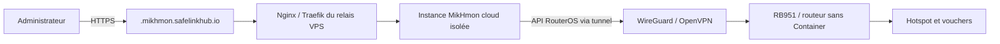

# MikHmon Online cloud avec domaines dédiés

**Date :** 2026-08-21

## Décision

Les MikroTik qui ne supportent pas RouterOS Container (RB951, hEX, hEX S,
wAP et autres architectures MIPS) n'installent jamais MikHmon sur le routeur.
Lorsqu'un opérateur active MikHmon Online, SafeLinkHub démarre une instance
MikHmon isolée sur le relais VPS et l'expose sous un sous-domaine HTTPS propre
au routeur :

```
https://<slug-routeur>.mikhmon.safelinkhub.io
```

Le tunnel WireGuard/OpenVPN existant demeure le seul chemin entre cette
instance et l'API RouterOS. Le routeur ne reçoit ni conteneur, ni bridge
DOCKERS, ni règle NAT pointant vers une adresse de conteneur.

## Constat actuel

- `device-detect.ts` détecte correctement les RB951 et autres modèles MIPS
  avec `supportsContainers = false`.
- L'auto-setup les configure déjà en mode « Hotspot seul » et saute la phase
  MikHmon locale.
- L'écran MikHmon Online et l'activation d'accès distant supposent encore un
  conteneur local, notamment la redirection du port tunnel `8089` vers
  `11.11.11.11:80`. Cette hypothèse rend MikHmon indisponible sur les modèles
  sans conteneur.
- Le relais possède déjà des hôtes de shards pour les accès techniques, mais
  aucun proxy à sous-domaines par routeur ni persistance d'instance cloud.

## Architecture retenue



### Domaine

- La base est configurée par `MIKHMON_CLOUD_BASE_DOMAIN`, avec
  `mikhmon.safelinkhub.io` comme valeur de production attendue.
- Chaque instance reçoit un slug stable, dérivé du nom du routeur et complété
  d'un suffixe court pour garantir l'unicité sans révéler l'identifiant de la
  base.
- Le DNS utilise un enregistrement wildcard `*.mikhmon.safelinkhub.io` vers
  le VPS. Le certificat TLS wildcard couvre les sous-domaines.
- Les URLs de shards avec port restent compatibles pour les accès distants
  classiques, mais ne sont pas affichées pour une instance cloud.

### Instance cloud

- Une ligne `router_mikhmon_cloud_instances` est créée par routeur,
  incluant le sous-domaine, le nom de conteneur, le port loopback, son état et
  les dates de création/mise à jour.
- Le conteneur ne publie que sur `127.0.0.1:<port>` ; il n'est jamais exposé
  directement sur Internet.
- Sa configuration MikHmon cible l'adresse `tunnelIp` du routeur et ses
  identifiants API chiffrés, fournis au démarrage sans les écrire dans les
  journaux ni dans la base en clair.
- Le proxy du relais résout uniquement les sous-domaines enregistrés et
  actifs. Un sous-domaine inconnu renvoie `404`, sans choisir une instance par
  défaut.

### Activation et désactivation

1. L'activation MikHmon vérifie l'accès authentifié, l'organisation du
   routeur, le tunnel, et que le routeur ne supporte pas les conteneurs.
2. Elle réserve un sous-domaine et un port loopback, démarre l'instance cloud,
   puis configure/recharge le proxy atomiquement.
3. L'écran MikHmon Online retourne l'URL HTTPS dédiée et le badge
   « Hébergé dans le cloud ».
4. La désactivation arrête et supprime l'instance, libère le port et enlève la
   configuration de proxy. Elle ne modifie aucune ressource RouterOS.
5. Pour les routeurs compatibles Container, le comportement actuel demeure :
   MikHmon local, accès via tunnel/port existant, sans domaine cloud.

## Limites et sécurité

- Un tunnel déconnecté ne déclenche ni fallback WAN ni exposition de l'API
  RouterOS ; l'URL affiche une indisponibilité contrôlée.
- Une instance cloud est provisionnée uniquement après l'autorisation d'accès
  distant existante. La facturation et les droits restent centralisés dans le
  service de port-forward.
- L'accès MikHmon reste protégé par ses identifiants applicatifs. Le proxy
  ajoute TLS, isole les instances et ne remplace pas cette authentification.
- La création réelle du wildcard DNS, du certificat et de la capacité Docker
  du VPS est une opération d'infrastructure séparée : elle n'est pas exécutée
  depuis l'application ni dans cette modification de code.

## Tests et validation

- Tests unitaires de génération de slug/sous-domaine et de refus de valeurs
  invalides ou collisions.
- Tests de provisioning simulé : un routeur sans conteneur crée une instance
  cloud ; un routeur compatible conserve le chemin local.
- Tests d'autorisation et d'idempotence à l'activation/désactivation.
- Test de rendu : l'écran affiche le domaine HTTPS et l'origine cloud.
- Validation manuelle, après déploiement de l'infrastructure : création d'une
  instance pour un RB951 réellement connecté, connexion MikHmon, création et
  expiration d'un voucher, puis arrêt contrôlé du tunnel.

## Critères de recette

- [ ] Un RB951 auto-configuré ne reçoit ni `/container/add` ni
  `/interface/veth/add`.
- [ ] L'activation MikHmon d'un RB951 crée une seule instance cloud et une URL
  HTTPS sans port public.
- [ ] Une seconde activation réutilise l'instance existante sans en démarrer
  une autre.
- [ ] La désactivation retire l'instance et son virtual host, sans modifier le
  routeur.
- [ ] Un hAP ax² conserve son conteneur RouterOS et son lien de relais actuel.
