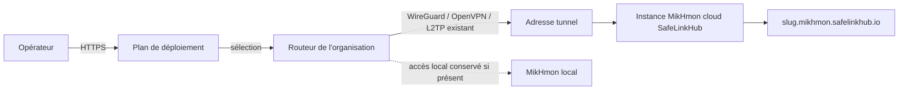

# MikHmon Online — plan de déploiement SafeLinkHub

**Date :** 2026-09-25

## Décision

MikHmon Online devient le point d'entrée cloud unique pour **tout routeur
MikroTik relié à SafeLinkHub par un tunnel actif**, sans distinguer l'accès
cloud selon la capacité Container du routeur :

- RouterOS 7+ avec Container ;
- RouterOS 7+ sans Container ;
- RouterOS 6 sans Container.

Une instance MikHmon est hébergée dans l'infrastructure SafeLinkHub et reliée
à l'adresse de tunnel déjà attribuée au routeur. Un accès MikHmon local déjà
présent sur un routeur compatible Container est conservé comme accès
secondaire ; le déploiement cloud ne le remplace ni ne le reconfigure.

Cette décision **remplace, pour l'expérience MikHmon Online**, la séparation
historique « cloud uniquement sans Container » décrite dans
`2026-08-21-mikhmon-cloud-dedicated-domains-design.md`. Les garanties
d'isolation, de sous-domaine HTTPS et de non-modification du routeur de cette
spécification restent valables.

## Objectif produit

Un opérateur doit pouvoir visualiser puis créer, dans un seul parcours, une
adresse MikHmon hébergée par SafeLinkHub. Le parcours doit expliquer le chemin
réseau et rendre explicites les choix qui peuvent avoir un impact : routeur,
tunnel utilisé, édition MikHmon et sous-domaine.

Le résultat doit être une interface conçue comme un produit : hiérarchie nette,
états réels, informations utiles au moment du choix et aucune étape artificielle
ou formulaire décoratif.

## Expérience retenue : « Plan de déploiement »

L'action primaire `Générer MikHmon Online` ouvre un dialogue plein écran ou
large, à quatre étapes. Il reprend la direction validée par l'utilisateur :
un plan vert forêt SafeLinkHub, accent lime `#D6F344`, cartes claires, capsules
de statut, angles souples et grand espacement. Cette direction est inspirée de
la charte visible sur safelinkhub.io, et non de l'interface sombre de la vidéo.

1. **Choisir le routeur** — recherche et sélection dans le parc. Chaque carte
   expose le modèle, RouterOS s'il est connu, la capacité Container et l'état
   du tunnel. Les routeurs éligibles sont disponibles ; les autres restent
   visibles avec la cause et un lien vers la configuration du tunnel.
2. **Vérifier le tunnel** — le plan montre `Routeur → VPN → Cloud SafeLinkHub`.
   WireGuard, OpenVPN et L2TP sont reconnus comme transports possibles. Seul
   un transport existant, doté d'une adresse de tunnel, peut être sélectionné ;
   le dialogue ne crée ni ne modifie de VPN.
3. **Choisir l'édition** — le choix conseillé est calculé depuis la capacité
   du routeur : v7 pour RouterOS 7+/Container, v6 pour RouterOS 6 sans
   Container. L'opérateur peut choisir l'autre édition lorsque l'offre le
   permet ; le libellé explique toujours la compatibilité RouterOS au lieu de
   réduire l'information à « v6 » ou « v7 ».
4. **Créer le domaine** — l'adresse proposée est dérivée du nom du routeur et
   validée avant l'envoi. La confirmation affiche le domaine HTTPS et rappelle
   que SafeLinkHub héberge l'instance sans écrire de Container, VETH ou NAT
   sur le routeur.

La page sous-jacente devient une vue de parc unifiée : domaines cloud actifs,
routeurs prêts, routeurs à reconnecter, recherche, et accès local secondaire
lorsqu'il existe. Elle n'est plus découpée en familles qui masquent la même
action selon la capacité Container.

## Règles d'éligibilité

Un routeur est prêt à générer une instance cloud s'il appartient à
l'organisation courante, possède une adresse `tunnelIp` non vide et emploie
l'un des transports suivants :

| Valeur stockée | Libellé opérateur | RouterOS attendu |
| --- | --- | --- |
| `vpn` | WireGuard | RouterOS 7+ |
| `openvpn` | OpenVPN | RouterOS 6 ou 7+ |
| `l2tp` | L2TP | RouterOS 6 ou 7+ |

`direct`, un tunnel inconnu ou une adresse de tunnel absente ne sont pas
éligibles. Le dialogue explique le blocage et propose de configurer le tunnel
plutôt que de laisser l'utilisateur aboutir à un échec tardif.

L2TP est pris en charge ici comme tunnel **déjà actif**. Aucun installateur,
serveur, script RouterOS ou changement de l'infrastructure VPN L2TP ne fait
partie de cette livraison, car le projet n'en contient pas actuellement.

## Architecture et données

Les données de la page restent chargées côté serveur pour l'organisation
authentifiée. Chaque routeur transmis au client contient seulement les
informations nécessaires à l'expérience : identifiant, nom, modèle, statut,
capacité Container, méthode de connexion, adresse de tunnel et instance cloud
éventuelle.

Le client effectue les choix et appelle l'action sécurisée existante de
provisionnement. L'action conserve ses contrôles d'organisation, d'accès
payant/superadmin et d'idempotence. Pour une instance cloud, le relais reçoit
l'adresse de tunnel et les identifiants chiffrés déjà prévus ; il n'expose que
le sous-domaine HTTPS enregistré. Il n'émet aucune commande RouterOS de
création ou de réparation Container/NAT.

## Composants et responsabilités

- `MikhmonOnlineConsole` : composition de la vue de parc, recherche, métriques
  utiles et ouverture de la génération.
- `MikhmonOnlineGenerationDialog` : progression, sélection du routeur,
  validation du transport, choix d'édition, domaine et confirmation. Il gère
  son focus, Escape, fermeture de l'overlay et états de chargement.
- `MikhmonCloudActivationDialog` : sera remplacé ou réduit à une vue
  compatible pour éviter deux parcours divergents.
- `resolveMikhmonCloudTunnel` : unique source de vérité pour interpréter les
  trois transports et leur disponibilité.
- `resolveMikhmonAccess` : retourne l'accès HTTPS lorsqu'une instance cloud
  existe, quelle que soit la capacité Container.

Les composants réutilisent les jetons existants (`--slate-deep`, `--brand`,
`--paper`, `--clay`, `--line-soft`) et les composants UI du projet. Aucun
nouveau framework UI, aucune dépendance et aucun asset externe ne sont ajoutés.

## États et traitement des erreurs

- Routeur non prêt : la prochaine action est désactivée avec une cause concrète
  (« adresse de tunnel absente », « accès direct », « transport inconnu »).
- Domaine invalide : l'erreur est portée par le champ et l'action est bloquée.
- Paiement/autorisation requise : conserver le modal existant, sans perdre les
  choix du dialogue.
- Provisionnement en cours : un seul bouton de soumission, indicateur visible,
  fermeture bloquée pendant l'écriture.
- Échec du relais ou du provisionnement : message lisible, aucun faux succès,
  choix conservés pour une nouvelle tentative.
- Succès : confirmation avec le sous-domaine HTTPS et rafraîchissement de la
  vue de parc.

## Tests et recette

Tests automatisés à ajouter ou adapter :

- le résolveur de tunnel accepte WireGuard, OpenVPN et L2TP seulement avec une
  adresse de tunnel ;
- l'accès cloud est retourné pour les routeurs avec ou sans Container ;
- l'édition recommandée reflète correctement les capacités connues ;
- un routeur direct, sans adresse de tunnel ou de capacité inconnue ne peut pas
  déclencher le provisionnement ;
- le rendu affiche le plan de déploiement, les trois protocoles, l'accessibilité
  du dialogue et l'accès local existant lorsque disponible.

Recette manuelle avant production : avec un routeur de chaque catégorie
(RouterOS 7 avec Container, RouterOS 7 sans Container, RouterOS 6), vérifier
la création d'un domaine unique, l'ouverture HTTPS, la connexion MikHmon au
routeur par le tunnel choisi et l'absence de modification RouterOS. Vérifier
aussi le chemin L2TP uniquement lorsqu'un tunnel L2TP réel existe déjà.

## Hors périmètre

- créer, installer ou dépanner l'infrastructure L2TP ;
- migrer ou supprimer un MikHmon local existant ;
- changer le DNS wildcard, le certificat ou les hôtes Docker du relais ;
- déployer automatiquement en production avant la validation applicative,
  les tests et la disponibilité des variables/relai existants.
